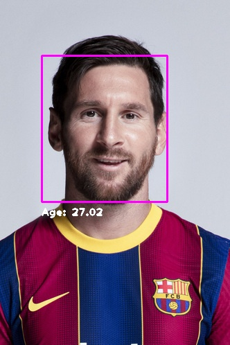
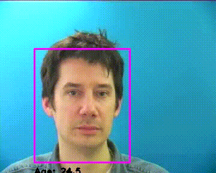

# Age Estimation
## This task solved with this repo
- Age Estimation: I trained a regression model on [UTKFace Dataset](https://www.kaggle.com/jangedoo/utkface-new) to estimate a person's age based on human facial appearance, using ResNet50 convolutional neural network

## How to install
### Run this command:
```bash
pip install -r requirements.txt
```
#### ***You can also download my age estimator model from [here](https://drive.google.com/file/d/1-AV5YBOrg1QjalfOzf4-kZrj4xD6NzP_/view?usp=sharing)***
*Traning Information:*
- Validation Loss: *5.6115*
- Training Loss: *2.4291*

## How to process on an image:
#### *Note: I used OpenCV cascading to detect faces. You can use any other face detector.*
### Run this command
```bash
python3 processing_on_image.py --img YOUR_IMAGE.JPG
```
#### You can also see the other arguments of it with this command
```bash
python processing_on_image.py --help
```
*For Example:*
- *`--model`*: The age estimator model file path **default:***`weights/best_age_estimator_resnet.h5`*
- *`--draw, --no-draw`*: You can draw bounding boxes on the image. **default:***`True`*
- *`--show, --no-show`*: You can see the result by this command **default:***`True`*
- *`--save, --no-save`*: You can save the result by this command **default:***`True`*

### Result of age estimator on Messi image:



## How to process on a video:
### Run this command
```bash
python3 main.py --source YOUR_VIDEO_PATH OR CAMERA_ID
```
#### You can also see the other arguments of it with this command
```bash
python main.py --help
```
*For Example:*
- *`--model`*: The age estimator model file path **default:***`weights/best_age_estimator_resnet.h5`*
- *`--draw, --no-draw`*: You can draw bounding boxes on the image. **default:***`True`*

### Result of age estimator on Messi image:
<!-- TODO: change it to a gif -->

